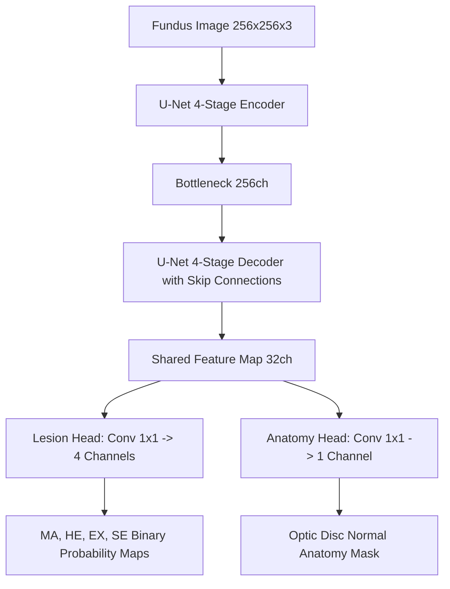

# RetinaGuard — Dual-Head U-Net Lesion & Anatomical Segmentation Model

## 1. Architecture Overview

RetinaGuard employs a specialized **Dual-Head U-Net** architecture to perform deep learning semantic segmentation on color retinal fundus photographs.

### Architectural Specifications
- **Input Dimensions**: $256 \times 256 \times 3$ (RGB)
- **Normalization**: Standard ImageNet mean ($[0.485, 0.456, 0.406]$) and standard deviation ($[0.229, 0.224, 0.225]$)
- **Encoder**: 4 levels with double $3 \times 3$ convolutions, Batch Normalization, ReLU activations, and $2 \times 2$ MaxPool downsampling. Channel progression: $32 \rightarrow 64 \rightarrow 128 \rightarrow 256$.
- **Bottleneck**: 256 channels.
- **Decoder**: 4 levels of bilinear upsampling with concatenated skip connections from corresponding encoder stages and double convolutions. Channel progression: $256 \rightarrow 128 \rightarrow 64 \rightarrow 32$.
- **Decoupled Heads**:
  1. **`lesion_head`** ($1 \times 1$ conv $\rightarrow 4$ channels): Specialized for Diabetic Retinopathy pathology:
     - Channel 0: **Microaneurysms (MA)**
     - Channel 1: **Haemorrhages (HE)**
     - Channel 2: **Hard Exudates (EX)**
     - Channel 3: **Soft Exudates (SE)**
  2. **`anatomy_head`** ($1 \times 1$ conv $\rightarrow 1$ channel): Specialized for normal anatomical structure:
     - Channel 4: **Optic Disc (OD)**

---

## 2. Decoupling Pathology from Anatomy: Design Rationale

In standard naive multi-class segmentation models, optic disc is often treated as a class alongside lesions. In RetinaGuard, we explicitly decouple them:

1. **Clinical Distinction**: Optic Disc is **normal anatomy** (the nerve head), not a disease lesion. Conflating normal structures with diabetic retinopathy lesions violates clinical ontology.
2. **Extreme Class Imbalance**: In the IDRiD dataset, the Optic Disc covers $\approx 1.81\%$ of retinal pixels, whereas Microaneurysms cover only $\approx 0.10\%$ (an 18:1 ratio). In an unweighted joint tensor, optic disc gradients dominate backpropagation, causing the network to ignore subtle microaneurysms.
3. **Decoupled Loss Function**:
   $$\mathcal{L}_{\text{total}} = \mathcal{L}_{\text{lesion}} + 0.5 \times \mathcal{L}_{\text{anatomy}}$$
   where $\mathcal{L}_{\text{lesion}}$ applies higher loss weighting ($w_{\text{MA}} = 1.5$) to compensate for extreme lesion sparsity.

---

## 3. Loss Formulation

Each output channel uses a combination of **Binary Cross-Entropy (BCE)** and **Soft Dice Loss**:

$$\mathcal{L}_{\text{BCE}}(p, y) = - \left[ y \log(\sigma(p)) + (1 - y) \log(1 - \sigma(p)) \right]$$

$$\mathcal{L}_{\text{Dice}}(p, y) = 1 - \frac{2 \sum \sigma(p) y + \epsilon}{\sum \sigma(p) + \sum y + \epsilon}$$

$$\mathcal{L}_{\text{channel}} = 0.5 \mathcal{L}_{\text{BCE}} + 0.5 \mathcal{L}_{\text{Dice}}$$

---

## 4. Training Protocol

- **Dataset**: IDRiD Part A (ISBI 2018 Diabetic Retinopathy Segmentation Challenge).
- **Training Subset**: 44 images (random 80/20 train/val split of the 54 official training images).
- **Validation Subset**: 10 images (used for model selection and early stopping).
- **Test Subset**: 27 official test images (strictly held out; never seen during training or tuning).
- **Optimizer**: AdamW ($\beta_1 = 0.9, \beta_2 = 0.999$, weight decay $= 1 \times 10^{-4}$).
- **Learning Rate Schedule**: Cosine Annealing from $\eta_{\text{max}} = 1 \times 10^{-3}$ to $\eta_{\text{min}} = 1 \times 10^{-5}$ over 20 epochs.
- **Batch Size**: 4.
- **Data Augmentations**: Random horizontal flips ($p=0.5$), vertical flips ($p=0.5$), and $90^\circ/180^\circ/270^\circ$ orthogonal rotations.

---

## 5. Deployment & Export Artifacts

All model artifacts are stored in `models/experiments/lesion_segmentation/`:
- **`best_model.pt`** ($40.3\text{ MB}$): Best checkpoint saved at epoch 15.
- **`final_model.pt`** ($13.5\text{ MB}$): Final epoch state dictionary.
- **`lesion_unet.onnx`** ($12.78\text{ MB}$): Optimized ONNX Runtime CPU export with dynamic batch axes.
- **`config.yaml`**: Full hyperparameter specification.
- **`training_log.json`**: Epoch-by-epoch loss and validation metrics.

---

## 6. Heuristic Fallback Integration

RetinaGuard incorporates an automatic, fail-safe **Heuristic Fallback Engine**:
- If `lesion_unet.onnx` or the PyTorch checkpoint cannot be loaded, the pipeline falls back to classical mathematical morphology:
  - Microaneurysms: Green-channel morphological top-hat filtering.
  - Hard Exudates: Luminance thresholding with optic-disc rim dilation masking.
  - Hemorrhages: Dark lesion connected-component analysis.
- The UI explicitly renders the active mode:
  - **`AI SEGMENTATION`** (when Dual-Head U-Net generates predictions)
  - **`HEURISTIC FALLBACK`** (when classical morphology is active)
